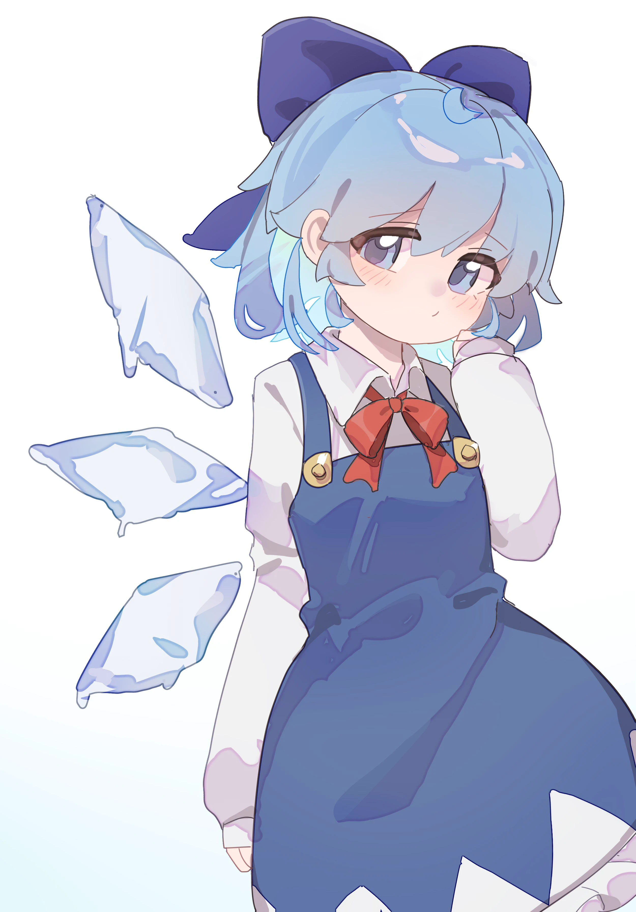
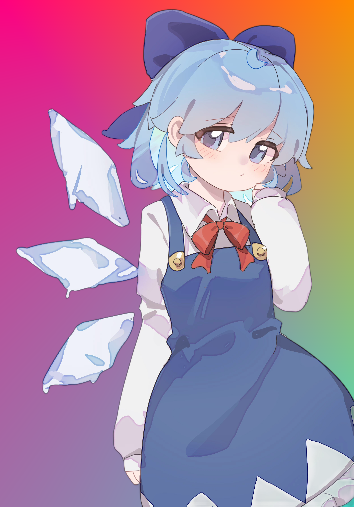
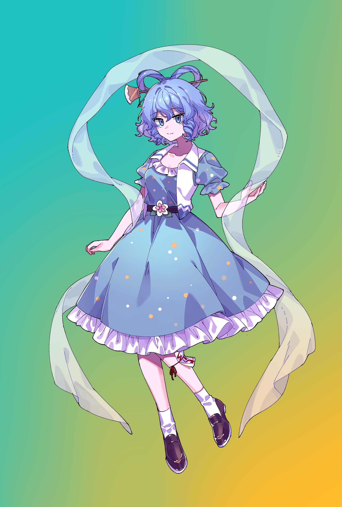
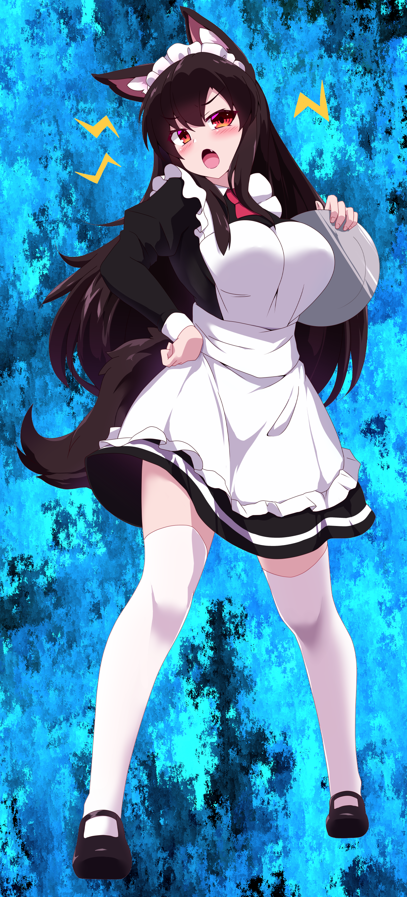
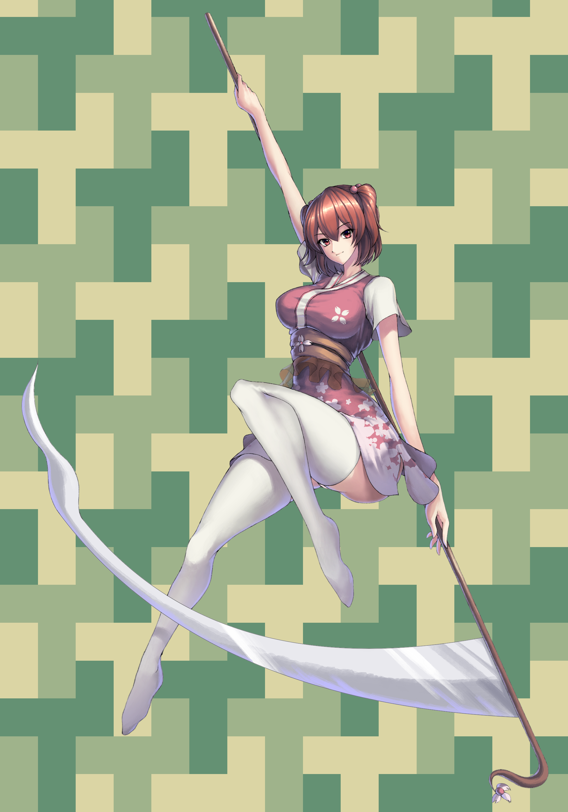

# Jig Gradientify: Replace Image Backgrounds with Beautiful Gradients & Patterns

Gradientify is a powerful command-line tool that replaces image backgrounds with stunning gradients and shader-based patterns. Perfect for making jigs less boring, especially with images where there are lone subjects and/or the background is very dull. This tool will make those images more entertaining for online jigsaw puzzles. You could also use this tool for whatever.

Features

    🎨 Multiple background styles: Linear gradients, liquid effects, topographic maps, spirals and more

    ✨ AI Cutout: Remove backgrounds from images. Powered by [rembg](https://github.com/danielgatis/rembg)

    🖼️ Transparency support: Preserve existing transparency or replace only transparent areas

    🧪 Mask refinement: Clean up edges with morphological operations

    🔄 Batch processing: Process multiple images at once

    🏷️ Preset gradients: Choose from a vast range of (semi)professionally designed color schemes

    🎚️ User Provided or Custom gradients: Pass your own color combinations or even have your own library of gradients

    📐 Orientation control: Adjust gradient direction

### Installation

Clone the repository:

```bash
git clone https://github.com/yourusername/gradientify.git
cd gradientify
```

### Install dependencies:

```bash
python -m venv .venv
source .venv/bin/activate  # On Windows use .venv\Scripts\activate
pip install -r requirements.txt
```

## Important notes
It's highly recommended your images to be in PNG format and have transparency already. If it doesn't, you can use the script's AI image cutout feature for background removal. It also has a fallback dumb background remover but is not recommended. Read on for more details.
If the image doesn't uphold a quality transparency to your tastes, consider the following:
1. **Use this script with a different AI model**: check out available models at [rembg](https://github.com/danielgatis/rembg)'s documentation. You can specify a different model using the `--model` option. NOTE: models are downloaded automatically, be aware they can be large (hundreds of MBs).
2. **Use an online background remover**: Websites like `withoutbg.com` or `pixlr.com` can automatically remove backgrounds from images, making them transparent.
3. **Ask the original creator**: If you have access to the original image files, ask the creator to provide a version with a transparent background.
4. If you get your images from imageboards like `gelbooru.com` you can use the tag `transparent_background` or similar to have transparency from origin.
5. **Use a photo editing tool**: Open your image in software like Photoshop, GIMP, Krita or an online editor. Use the magic wand or lasso tool to select the background and delete it, leaving a transparent layer.
6. Once you have your images with transparency already included, use the tool with the `--only-transparent`  or `-ot` option to replace only the transparent areas with gradients or patterns.

## Automatic Background Removal
The script includes an AI-powered background removal feature that works well for images with clear subjects. It is turned on by default. It uses the `rembg` library to automatically detect and remove backgrounds, it works pretty well for most images but is not perfect.
Features:
1. Uses [rembg](https://github.com/danielgatis/rembg) for AI-powered background removal.
2. The script will try to detect if a image with the postfix "_transparent.png" already exists, and if it does, it will skip the background removal step.
3. If your image is already transparent, you can use the `--only-transparent` or `-ot` option to replace only the transparent areas with gradients or patterns.
4. The script will save the resulting transparent image with the postfix "_transparent.png" in the same directory as the original image.

### Background Removal Example

### Before:

### After:


## Basic Usage

Replace background with default gradient, will remove background automatically:
```bash
python main.py image.png
```

Use a specific preset gradient, using an image with transparency included:
```bash
python main.py --gradient sunset -ot image.png
```

Use topographic style with ocean bliss gradient:
```bash
python main.py --style topographic --gradient oceanbliss image.png
```

## Advanced Usage

Batch Processing

Process all images in current directory:
```bash
python main.py
```

Process specific images with custom settings:
```bash
python main.py --style liquid --gradient fireandice -ot image1.png image2.jpg
```

## Background Styles

1. **Linear/Barycentric (Gradient)**:
Creates smooth color transitions. Supports linear (2 colors) and barycentric (3 colors) gradients.


2. **Mesh (Gradient)**:
Creates complex, multicolor transitions across a shape by creating a grid of random nodes. Supports 2-3 colors.


3. **Liquid**:
Organic, flowing patterns that simulate liquid movements. Requires exactly 2 colors.


4. **Voronoi**:
Cellular patterns based on Voronoi diagrams. Creates a geometric, tech-inspired look.


5. **Topographic**:
Contour map-like patterns that simulate elevation. Works best with 2-4 colors.


6. **Spiral**:
Hypnotic spiral patterns that create visual depth. Requires exactly 2 colors.


7. **Squiggle**:
Playful squiggly line patterns that add artistic flair. Supports 2-4 colors.


8. **Scales**:
Scales create a fish-like texture with overlapping shapes. Requires 2 or 3 colors.


9. **Watercolor**:
Soft, blended patterns that mimic watercolor painting. Requires 2 or 3 colors.


10. **Hexagons3d**:
Creates a 3D hexagonal pattern that adds depth and complexity. Requires 2 or 3 colors.


11. **Triwedges**:
Triwedges create a triangular tessellation pattern that adds geometric interest. Requires 2 or 3 colors.


12. **Cacti**:
Cacti, desert-inspired pattern with overlapping shapes. Requires 2 or 3 colors.


## Advanced Options
To check out all available options, run the following command:
```bash
python main.py --help
```

## User Provided Gradients
You can provide your own gradients using the following JSON format:
```json
{
    "my_custom_gradient_2": ["#ff0000", "#00ff00"],
    "my_custom_gradient_3": ["#ff0000", "#00ff00", "#0000ff"]
}
```

Then, you can pass your custom gradients passing this JSON file using the `--user-gradients` option:
```bash
python main.py --user-gradients mypresets.json --gradient my_custom_gradient_2 image.png
```

When you let the script choose random gradients, you can choose between either combine them with script's preset gradients or to only use your gradients by passing either `--combine-presets` or `--only-user-gradients` respectively:
```bash
# Leaving it defaults to combine both, although you can also use --combine-presets to be explicit
python main.py image.png -ot

# Only use your gradients
python main.py --only-user-gradients image.png -ot
```

Currently, the program supports only 2-3 color gradients.

## Contribution

Contributions are welcome! Please open an issue or pull request for:

    New gradient presets

    Additional shader styles

    Performance improvements

    Documentation enhancements
