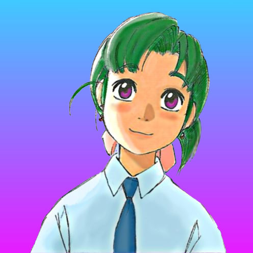
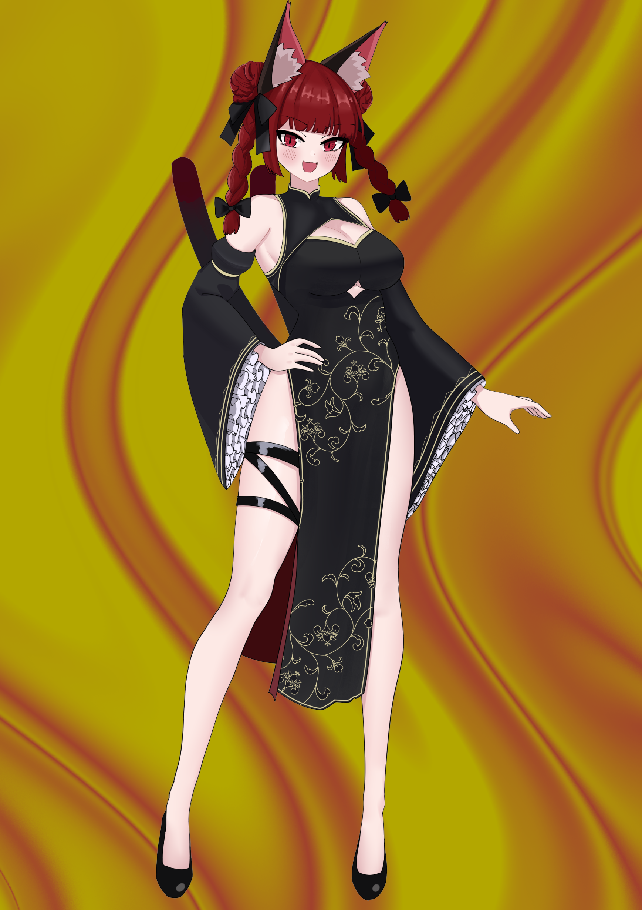
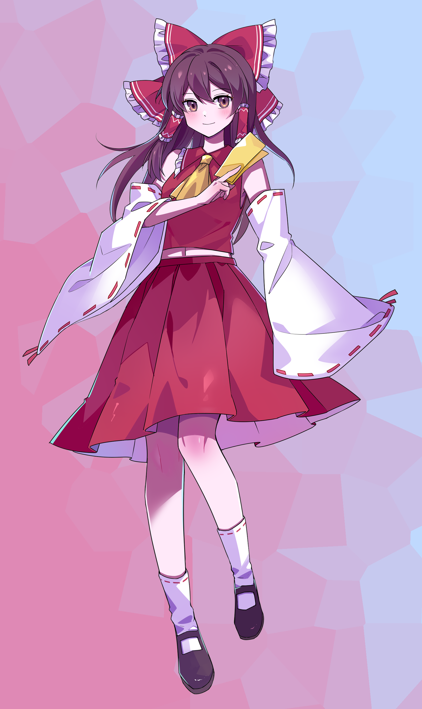
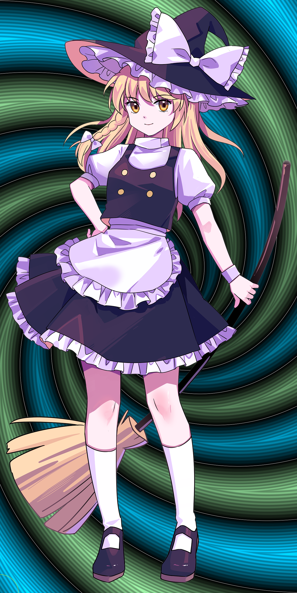
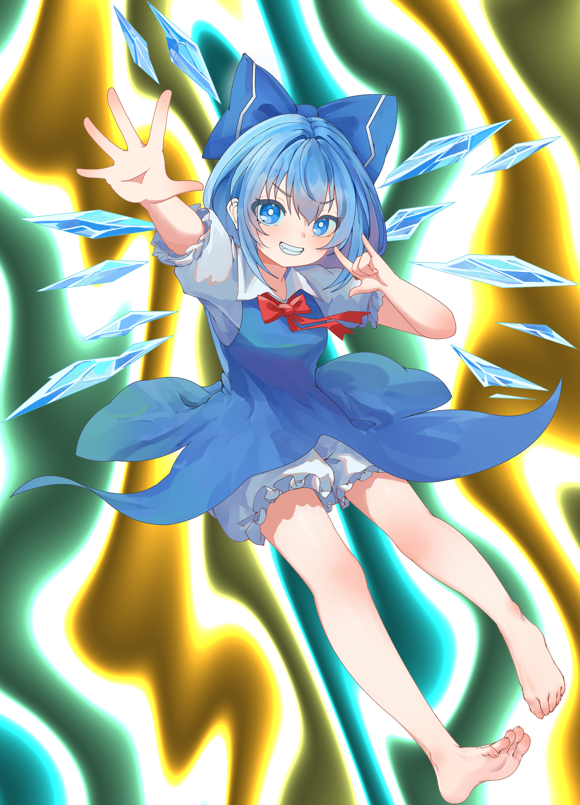

# Jig Gradientify: Replace Image Backgrounds with Beautiful Gradients & Patterns

Gradientify is a powerful command-line tool that replaces image backgrounds with stunning gradients and shader-based patterns. Perfect for making jigs less boring, especially with images where there are lone subjects and/or the background is very dull. This tool will make those images more entertaining for online jigsaw puzzles. You could also use this tool for whatever.

Features

    🎨 Multiple background styles: Linear gradients, liquid effects, topographic maps, spirals and more

    ✨ Smart background removal: Remove backgrounds with adjustable sensitivity

    🖼️ Transparency support: Preserve existing transparency or replace only transparent areas

    🧪 Mask refinement: Clean up edges with morphological operations

    🔄 Batch processing: Process multiple images at once

    🏷️ Preset gradients: Choose from 26 professionally designed color schemes

    🎚️ Custom gradients: Pass your own color combinations

    📐 Orientation control: Adjust gradient direction

### Installation

Clone the repository:

```bash
git clone https://github.com/yourusername/gradientify.git
cd gradientify
```

### Install dependencies:

```bash
python -m venv .venv
source .venv/bin/activate  # On Windows use .venv\Scripts\activate
pip install -r requirements.txt
```

## Important notes
It's highly recommended your images to be in PNG format and have already transparency. While the script can handle images without transparency with solid color backgrounds, the script will not be able to accurately remove the background in most cases. For best results, use images with transparent backgrounds. Below some recommendations how to make your images transparent:
1. **Use a photo editing tool**: Open your image in software like Photoshop, GIMP, Krita or an online editor. Use the magic wand or lasso tool to select the background and delete it, leaving a transparent layer.
2. **Use an online background remover**: Websites like `withoutbg.com` or `pixlr.com can automatically remove backgrounds from images, making them transparent. Note: some of these websites have limitations on how many you can process per day. Personally, withoutbg.com is my favorite.
3. **Ask the original creator**: If you have access to the original image files, ask the creator to provide a version with a transparent background.
4. Once you have your images with transparency, use the tool with the `--only-transparent`  or `-ot` option to replace only the transparent areas with gradients or patterns.

### Basic Usage

Replace background with default gradient, replacing only transparent areas:
```bash
python main.py image.png -ot
```

Use a specific preset gradient:
```bash
python main.py --gradient sunset -ot image.png
```

Use topographic style with ocean bliss gradient:
```bash
python main.py --style topographic --gradient -ot oceanbliss image.png
```

### Advanced Usage

Batch Processing

Process all images in current directory:
```bash
python main.py
```

Process specific images with custom settings:
```bash
python main.py --style liquid --gradient fireandice -ot image1.png image2.jpg
```

### Background Styles

1. **Gradient** (Linear/Barycentric):
Creates smooth color transitions. Supports linear (2 colors) and barycentric (3 colors) gradients.


2. **Liquid**:
Organic, flowing patterns that simulate liquid movements. Requires exactly 2 colors.


3. **Voronoi**:
Cellular patterns based on Voronoi diagrams. Creates a geometric, tech-inspired look... If you really squint your eyes.


4. **Topographic**:
Contour map-like patterns that simulate elevation. Works best with 2-4 colors.

5. **Spiral**:
Hypnotic spiral patterns that create visual depth. Requires exactly 2 colors.

6. **Squiggle**:
Playful squiggly line patterns that add artistic flair. Supports 2-4 colors.
   

### Advanced Options
```text
Options:
--fuzziness INTEGER RANGE       Background removal sensitivity (1-100%%,
default: 1) - Ignored in only-transparent
mode  [1<=x<=100]
--gradient TEXT                 Preset name or custom gradient (#hex,#hex or
#hex,#hex,#hex)
--bgcolor TEXT                  Background color to remove (hex format,
default: #ffffff) - Ignored in only-
transparent mode
--overwrite                     Overwrite existing output files
--refine-mask                   Apply intelligent mask refinement to clean
edges and fill holes
--close-radius INTEGER RANGE    Mask closing radius for filling holes (0-10,
default: 2)  [0<=x<=10]
--median-radius INTEGER RANGE   Median filter radius for smoothing edges
(0-5, default: 1)  [0<=x<=5]
-ot, --only-transparent         ONLY replace transparent background,
preserve all colored pixels (including
white)
-o, --orientation TEXT          Gradient orientation: 'vertical' (90°),
'horizontal' (0°), 'diagonal' (45°),
'diagonal-reverse' (135°), or custom angle
(0-360)
--style [gradient|liquid|voronoi|topographic|spiral|squiggle]
Background style: gradient
(linear/barycentric), liquid (liquid
gradient), spiral, topographic (map-like),
or squiggle
--shader-scale FLOAT            Shader pattern scale (default: 1)
--help                          Show this message and exit.
```

Contribution

Contributions are welcome! Please open an issue or pull request for:

    New gradient presets

    Additional shader styles

    Performance improvements

    Documentation enhancements
